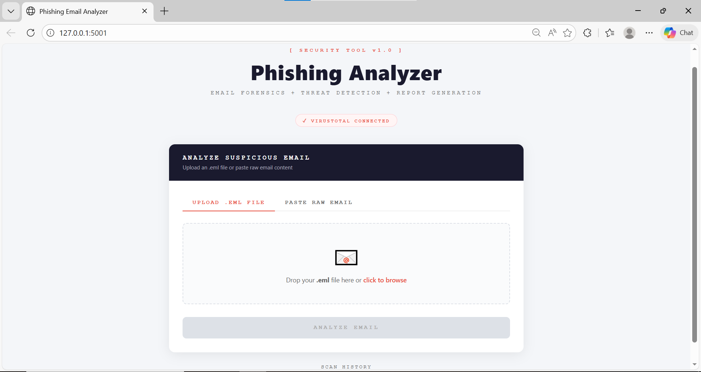
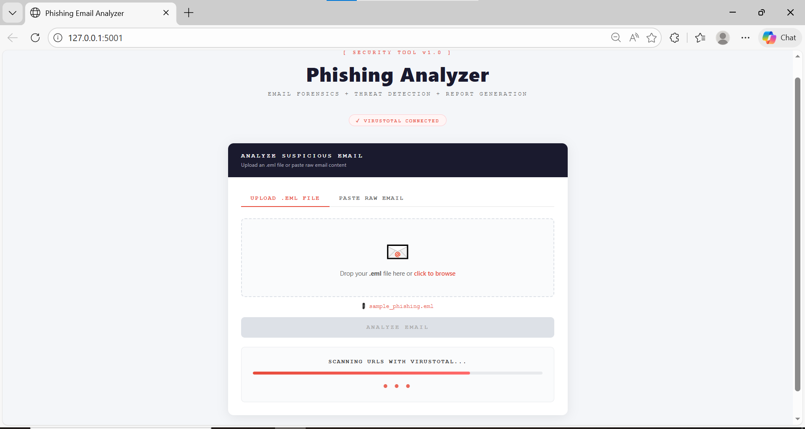
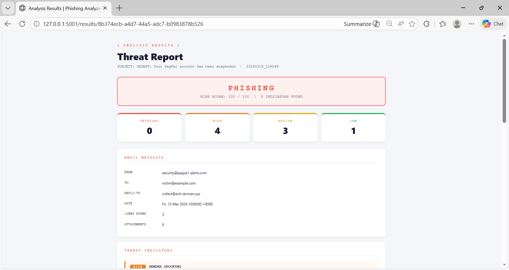
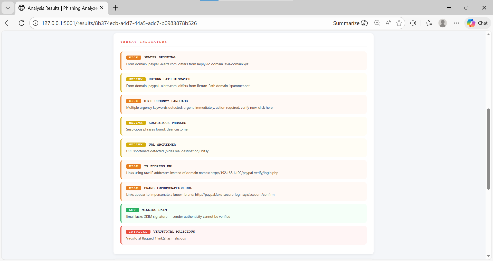
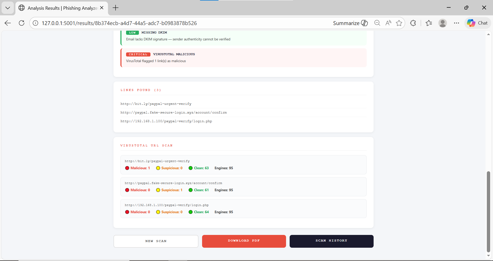
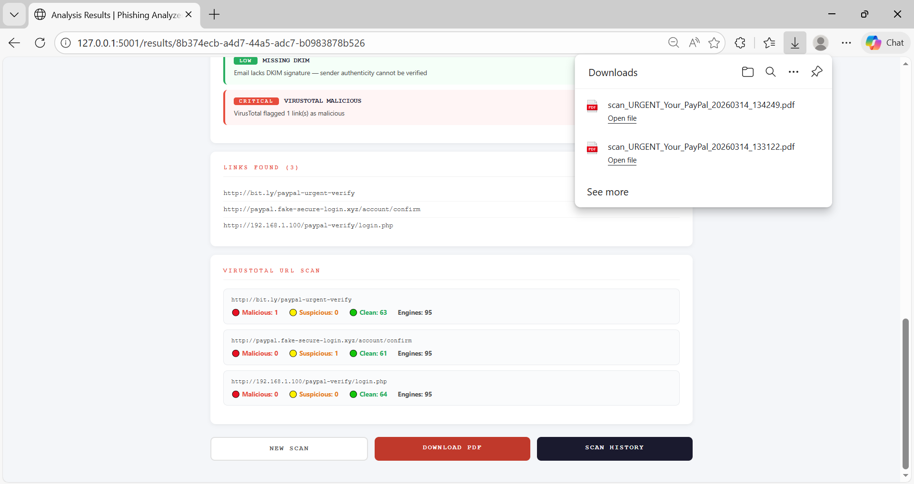

# 🎣 Phishing Email Analyzer

> **Detect phishing emails in seconds using real threat intelligence.**

A Python-based email forensics tool that automatically analyzes suspicious emails for phishing indicators, checks links against VirusTotal, scores threats using weighted severity, and generates professional PDF reports — all through a clean web interface.

---

## 🖥️ Screenshots

### Main Interface


### Analyzing in Progress


### Threat Report




### PDF Report Download


---

## ⚡ What It Detects

| Indicator | Severity | Description |
|---|---|---|
| Sender Spoofing | 🔴 HIGH | From/Reply-To domain mismatch |
| IP Address URLs | 🔴 HIGH | Links using raw IPs instead of domains |
| Brand Impersonation | 🔴 HIGH | Fake PayPal/Google/Microsoft links |
| Urgency Language | 🟠 HIGH | "Act now", "Account suspended", "Urgent" |
| URL Shorteners | 🟡 MEDIUM | bit.ly, tinyurl hiding real destinations |
| Return-Path Mismatch | 🟡 MEDIUM | Bounce address differs from sender |
| Dangerous Attachments | 🔴 CRITICAL | .exe, .bat, .ps1, .vbs files |
| Missing DKIM | 🟢 LOW | No email authentication signature |
| VirusTotal Scan | 🔴 CRITICAL | URLs flagged by 90+ security engines |

---

## 🛠️ Tech Stack

| Tool | Purpose |
|---|---|
| Python 3.x | Core language |
| Flask | Web interface |
| VirusTotal API v3 | Real-time URL threat scanning |
| ReportLab | PDF report generation |
| Python email library | Email parsing and header extraction |
| python-dotenv | Secure API key management |

---

## 📁 Project Structure

```
phishing-email-analyzer/
│
├── app.py                  # Flask web application
├── email_parser.py         # Email header + body + link extraction
├── analyzer.py             # Heuristic threat detection engine
├── virustotal.py           # VirusTotal API integration
├── report_generator.py     # PDF report generation
├── requirements.txt        # Python dependencies
├── sample_phishing.eml     # Test email for demo
├── .env                    # API keys (gitignored)
├── templates/
│   ├── index.html          # Main analyzer page
│   ├── results.html        # Threat report page
│   └── history.html        # Scan history page
├── reports/                # Generated JSON + PDF reports (gitignored)
└── uploads/                # Temporary email uploads (gitignored)
```

---

## 🚀 Installation & Setup

### 1. Prerequisites

- Python 3.x — [python.org](https://python.org/downloads)
- VirusTotal API Key (free) — [virustotal.com](https://www.virustotal.com/gui/my-apikey)

### 2. Clone the Repository

```bash
git clone https://github.com/eba-mohamed/phishing-email-analyzer.git
cd phishing-email-analyzer
```

### 3. Create Virtual Environment

```bash
python -m venv venv
venv\Scripts\activate        # Windows
source venv/bin/activate     # Linux / macOS
```

### 4. Install Dependencies

```bash
pip install -r requirements.txt
```

### 5. Configure API Key

Create a `.env` file in the root folder:

```
VT_API_KEY=your_virustotal_api_key_here
```

### 6. Run the App

```bash
py app.py
```

Open your browser at `http://127.0.0.1:5001`

---

## 🧪 Quick Test

A sample phishing email is included for testing. Just:

1. Open `http://127.0.0.1:5001`
2. Upload `sample_phishing.eml`
3. Click **ANALYZE EMAIL**
4. View the full threat report — expect a **PHISHING** verdict with score **100/100**

The sample email contains:
- Spoofed PayPal sender domain
- Raw IP address link
- URL shortener
- Brand impersonation URL
- Multiple urgency keywords

---

## 📊 Sample Output

```
VERDICT: PHISHING | RISK SCORE: 100/100

THREAT INDICATORS:
  [HIGH]     SENDER SPOOFING       — From domain differs from Reply-To
  [HIGH]     HIGH URGENCY LANGUAGE — urgent, immediately, action required
  [HIGH]     IP ADDRESS URL        — http://192.168.1.100/paypal-verify/
  [HIGH]     BRAND IMPERSONATION   — paypal.fake-secure-login.xyz
  [MEDIUM]   URL SHORTENER         — bit.ly link detected
  [MEDIUM]   RETURN PATH MISMATCH  — Bounce address differs from sender
  [MEDIUM]   SUSPICIOUS PHRASES    — "dear customer" detected
  [LOW]      MISSING DKIM          — No email authentication signature
```

---

## 🔒 Security Concepts Demonstrated

| Concept | Implementation |
|---|---|
| Email Forensics | Full header parsing — From, Reply-To, Return-Path, DKIM |
| Threat Intelligence | VirusTotal API — same engine used by enterprise security teams |
| Heuristic Analysis | Weighted scoring across 8 detection categories |
| Risk Scoring | CVSS-inspired 0–100 scoring with Critical/High/Medium/Low |
| Security Reporting | Auto-generated PDF reports matching SOC deliverable standards |
| Secure Development | .env for secrets management, .gitignore to prevent key exposure |
| Automation | End-to-end Python pipeline from email upload to PDF report |

---

## ⚠️ Disclaimer

This tool is intended for **educational purposes** and **authorized security analysis only**. Only analyze emails you own or have explicit permission to analyze. Unauthorized interception of communications may violate laws in your jurisdiction.

---

## 👤 Author

**EBA MOHAMED ABBAS AHMED**


[LinkedIn](https://linkedin.com/in/eba-ahmed-413690330) | [GitHub](https://github.com/eba-mohamed)